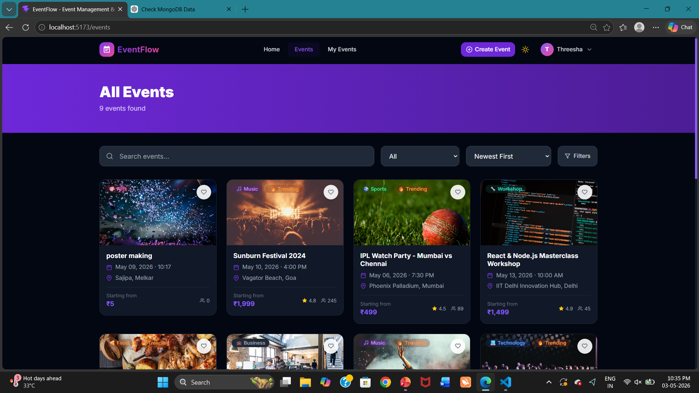
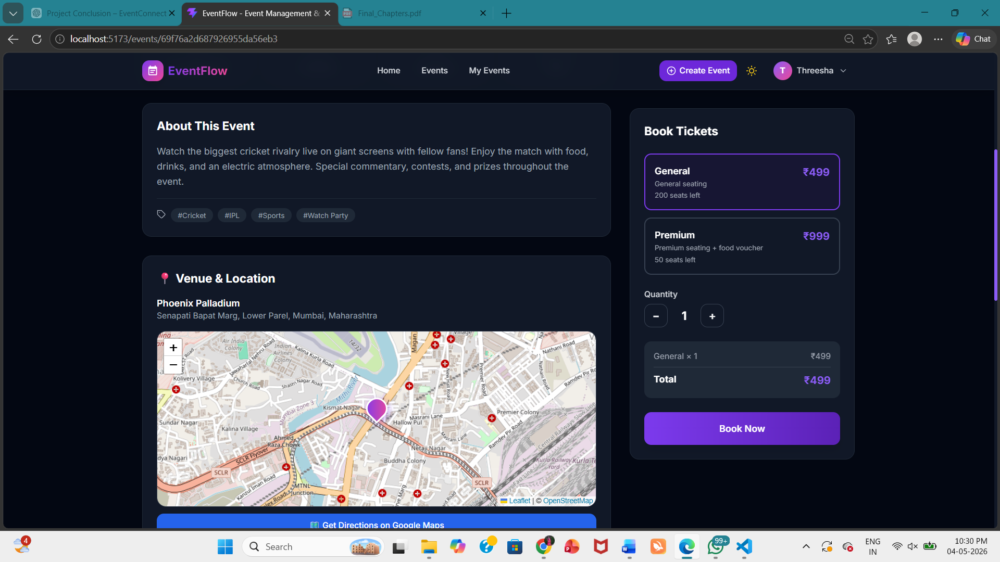
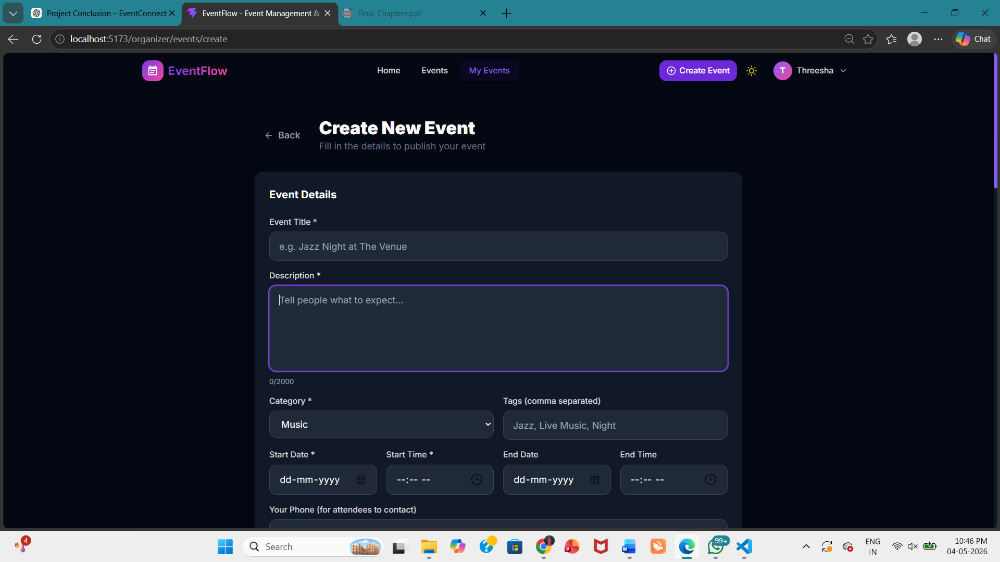
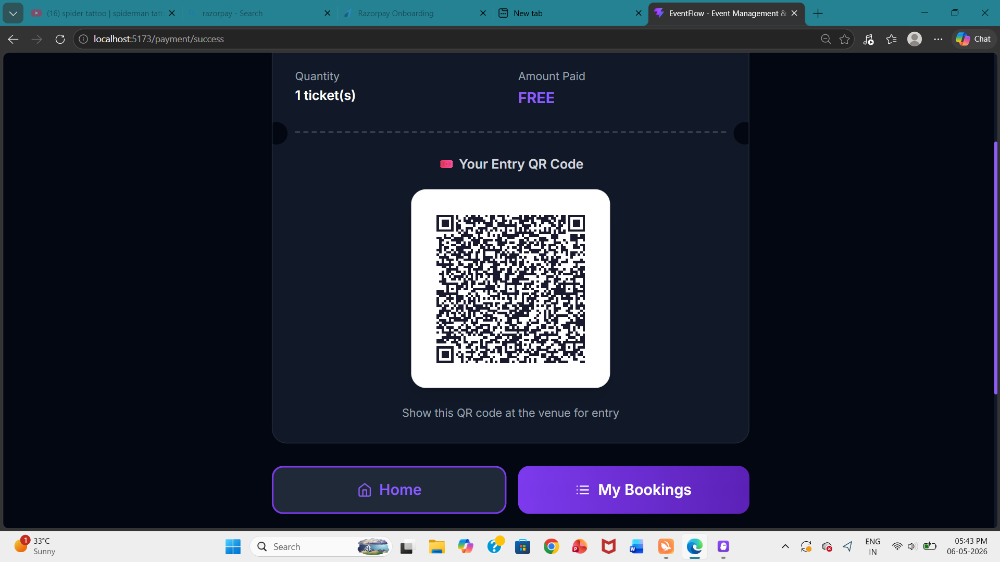

# 🎉 Event Connect Platform

A full-stack **Event Management and Booking System** built using the **MERN Stack** (MongoDB, Express.js, React.js, and Node.js).

## 🚀 Features

### 👤 User Features

* User Registration and Login
* JWT-based Authentication
* Browse and Search Events
* Filter Events by Category, Location, Date, and Price
* View Event Details
* Book Events
* Online Payment Integration
* View Booking History
* Upcoming and Completed Events
* Wishlist / Favourite Events
* User Profile Management
* QR Code / Booking ID for Event Check-in
* Interactive Event Location Map

### 🧑‍💼 Admin Features

* Admin Authentication
* Admin Dashboard
* Create Events
* Update Events
* Delete Events
* Manage Users
* Manage Bookings
* Manage Event Categories
* Feature / Promote Events
* View Event Statistics
* QR Code / Booking ID Validation

## 🛠️ Technologies Used

### Frontend

* React.js
* JavaScript
* HTML5
* CSS3
* Axios
* React Router
* Leaflet
* OpenStreetMap

### Backend

* Node.js
* Express.js
* MongoDB
* Mongoose
* JWT
* bcrypt
* REST API

### Payment & Other Tools

* Razorpay
* Git
* GitHub
* Postman
* Vercel
* Render

## 📁 Project Structure

```text
Event-Connect-Platform/
│
├── backend/
│   ├── controllers/
│   ├── middleware/
│   ├── models/
│   ├── routes/
│   ├── utils/
│   ├── uploads/
│   ├── server.js
│   └── package.json
│
├── frontend/
│   ├── src/
│   │   ├── components/
│   │   ├── pages/
│   │   ├── services/
│   │   ├── context/
│   │   └── App.jsx
│   │
│   └── package.json
│
└── README.md
```

## 📸 Screenshots

### 🎫 Events Page

<p align="center">
  
</p>

### 📋 Event Information

<p align="center">
  
</p>

### ➕ Create Event

<p align="center">
  
</p>

### 🔳 QR Code

<p align="center">
  
</p>


## ⚙️ Installation

### 1. Clone the Repository

```bash
git clone https://github.com/Threesha-03/Event-Connect-platform.git
```

```bash
cd Event-Connect-platform
```

### 2. Install Backend Dependencies

```bash
cd backend
npm install
```

### 3. Install Frontend Dependencies

Open another terminal:

```bash
cd frontend
npm install
```

## 🔐 Environment Variables

Create a `.env` file inside the `backend` folder.

```env
PORT=5000
MONGO_URI=mongodb://localhost:27017/eventdb
JWT_SECRET=your_jwt_secret
JWT_EXPIRE=7d

RAZORPAY_KEY_ID=your_razorpay_key
RAZORPAY_KEY_SECRET=your_razorpay_secret

CLIENT_URL=http://localhost:3000
```

For the frontend, create a `.env` file:

```env
VITE_API_URL=http://localhost:5000/api
```

> **Note:** Never upload your actual `.env` file or secret keys to GitHub.

## 🗄️ Database

This project uses **MongoDB**.

### Local MongoDB

```text
mongodb://localhost:27017/eventdb
```

Make sure MongoDB is running before starting the backend.

## ▶️ Run the Application

### Start Backend

```bash
cd backend
npm run dev
```

Backend:

```text
http://localhost:5000
```

### Start Frontend

Open another terminal:

```bash
cd frontend
npm run dev
```

Frontend:

```text
http://localhost:3000
```

or the URL provided by Vite.

## 📡 API Endpoints

### Authentication

| Method | Endpoint             | Description      |
| ------ | -------------------- | ---------------- |
| `POST` | `/api/auth/register` | Register a user  |
| `POST` | `/api/auth/login`    | Login            |
| `GET`  | `/api/auth/me`       | Get current user |
| `POST` | `/api/auth/logout`   | Logout           |

### Events

| Method   | Endpoint          | Description       |
| -------- | ----------------- | ----------------- |
| `GET`    | `/api/events`     | Get all events    |
| `GET`    | `/api/events/:id` | Get event details |
| `POST`   | `/api/events`     | Create an event   |
| `PUT`    | `/api/events/:id` | Update an event   |
| `DELETE` | `/api/events/:id` | Delete an event   |

### Bookings

| Method | Endpoint                    | Description         |
| ------ | --------------------------- | ------------------- |
| `POST` | `/api/bookings`             | Create booking      |
| `GET`  | `/api/bookings/my`          | Get user's bookings |
| `GET`  | `/api/bookings/:id`         | Get booking details |
| `PUT`  | `/api/bookings/:id/cancel`  | Cancel booking      |
| `POST` | `/api/bookings/validate-qr` | Validate QR code    |

### Payments

| Method | Endpoint                     | Description          |
| ------ | ---------------------------- | -------------------- |
| `POST` | `/api/payments/create-order` | Create payment order |
| `POST` | `/api/payments/verify`       | Verify payment       |
| `GET`  | `/api/payments/history`      | Payment history      |

### Users

| Method | Endpoint                       | Description     |
| ------ | ------------------------------ | --------------- |
| `PUT`  | `/api/users/profile`           | Update profile  |
| `PUT`  | `/api/users/change-password`   | Change password |
| `GET`  | `/api/users/wishlist`          | Get wishlist    |
| `POST` | `/api/users/wishlist/:eventId` | Toggle wishlist |

## 💳 Payment Integration

The project uses **Razorpay** for online payments.

To configure Razorpay:

1. Create a Razorpay account.
2. Generate Test API Keys.
3. Add the keys to the backend `.env` file.
4. Add the public key to the frontend `.env` file.

> Test keys should be used during development.

## 🗺️ Map Integration

The application uses:

* **Leaflet**
* **OpenStreetMap**

Users can view the event location on an interactive map.

Admins can specify the location of an event using map coordinates.

## 🎟️ Booking & QR Check-in

After successfully booking an event, the user receives booking information containing a unique **Booking ID / QR Code**.

The QR code can be validated by the admin during event check-in.

## 🔒 Security Features

* JWT Authentication
* Password hashing using bcrypt
* Protected routes
* Role-based authorization
* Input validation
* CORS protection
* Environment variables
* Duplicate booking prevention

## 🔄 Application Workflow

```text
User
 │
 ├── Register / Login
 │
 ├── Browse Events
 │
 ├── Search / Filter
 │
 ├── View Event Details
 │
 ├── Book Event
 │
 ├── Make Payment
 │
 └── Receive Booking
        │
        └── QR Code / Booking ID
                 │
                 └── Event Check-in
```

## 🎯 Project Objective

The main objective of the **Event Connect Platform** is to provide a centralized platform for users to **discover, explore, and book events online**, while allowing administrators to efficiently manage events, users, bookings, payments, and event check-ins.

## 🔮 Future Enhancements

* Email notifications
* Automated event reminders
* Event reviews and ratings
* Personalized event recommendations
* Advanced analytics
* Social media sharing
* Mobile application
* Refund management

## 👩‍💻 Developer

**Threesha**

B.E. Computer Science & Engineering

### ⭐ Event Connect Platform

Built with ❤️ using the **MERN Stack**.
